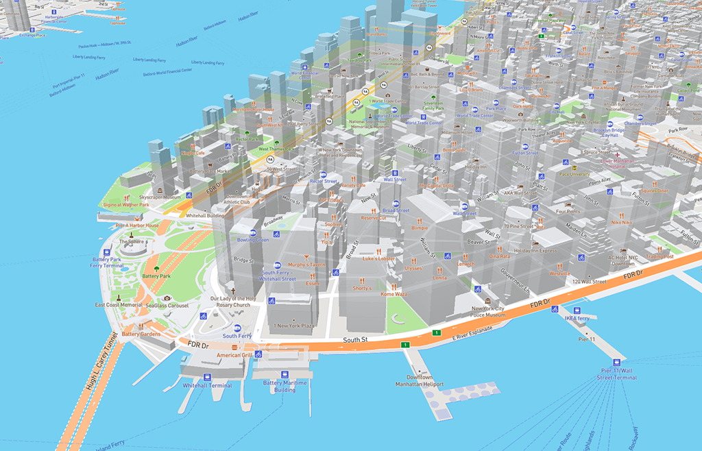
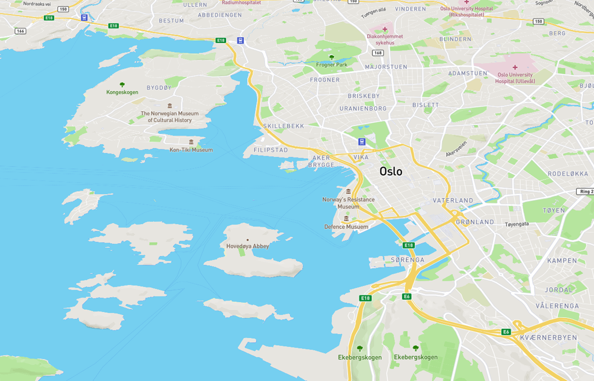
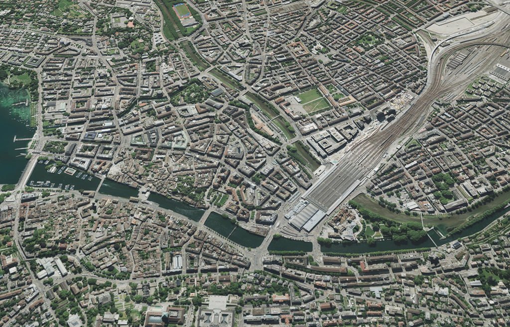
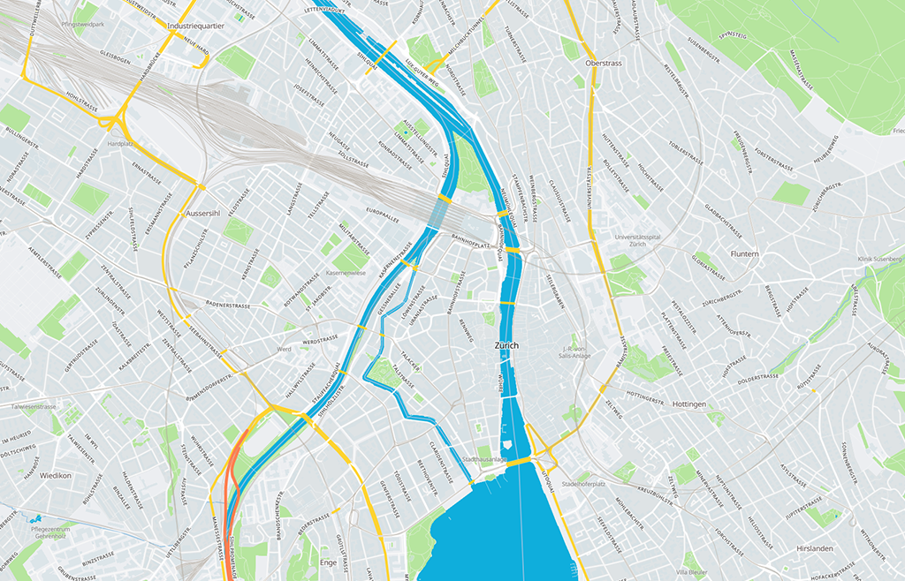
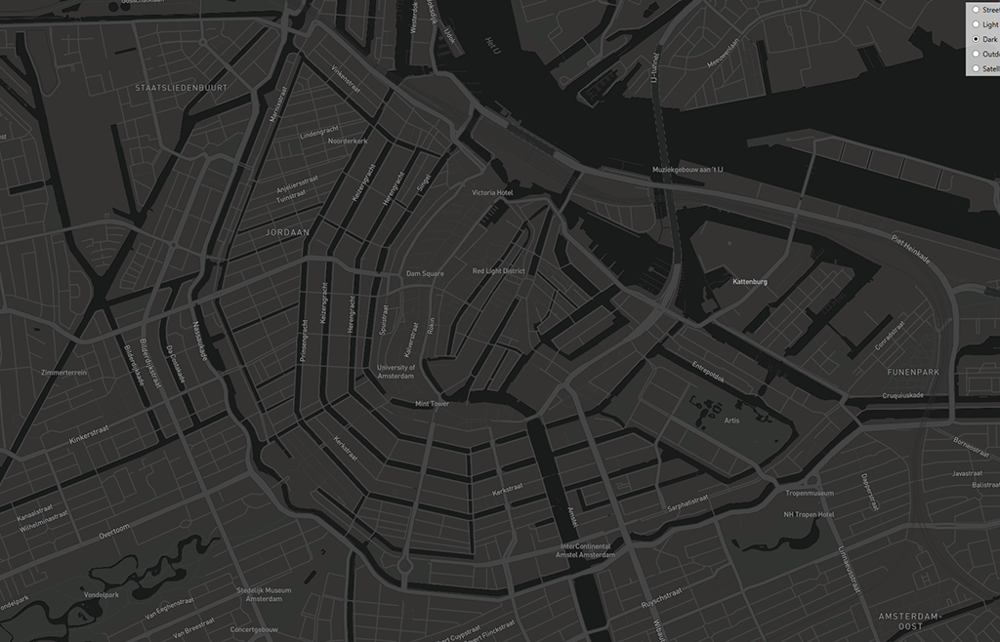

# MapboxNet

## A comprehensive Mapbox map control for WPF and WinForms



Complete vector map client based on Mapbox GL JS built using C# 

## Features

The map view has almost all the features of Mapbox GL JS, such as:

- Using mapbox default styles (streets, dark, satellite, etc...) or any custom style hosted on your mapbox account ([demo](blob/master/DemosWPF/StyleSwitchWindow.xaml))
- Support for GeoJSON polygons, lines, markers, images, videos, etc... ([geojson demo](blob/master/DemosWPF/GeoJsonWindow.xaml))
- Data binding support for WPF using dependency properties ([MVVM demo](blob/master/DemosWPF/DataBindingWindow.xaml))
- Can work completely offline without access token ([vector demo](blob/master/DemosWPF/LocalVectorWindow.xaml) and [satellite demo](blob/master/DemosWPF/LocalRasterWindow.xaml))
- Comes built-in with a map server that can serve mbtiles, png/pbf/jpg tiles, and fonts.
- Can be used with any custom tile source ([bing tiles demo](blob/master/DemosWPF/BingStyleWindow.xaml))
- Upto date support for [mapbox style specification](https://www.mapbox.com/mapbox-gl-js/style-spec/)
- Compatable with [mapbox/openmaptiles vector tile specification](https://www.mapbox.com/vector-tiles/specification/)
- Conversion between lat/lon and pixels, for overlaying WPF elements on map ([projection demo](blob/master/DemosWPF/XamlProjectionWindow.xaml))
- Both WPF and WinForms are supported
- MIT License




## What is a vector map?

Vector maps are the new generation of maps. Traditional map controls download maps from the internet in form of square image tiles, Vector maps download them in form of vector drawings (like SVG). They are then rendered on the client in realtime according to a style specification.

Vector maps are fast, fluent, scalable, highly customizable, and suitable for offline storage as well. 

## Examples

### Hello World

```xml
<Window x:Class="DemosWPF.HelloWorldWindow"
        xmlns="http://schemas.microsoft.com/winfx/2006/xaml/presentation"
        xmlns:x="http://schemas.microsoft.com/winfx/2006/xaml"
        xmlns:d="http://schemas.microsoft.com/expression/blend/2008"
        xmlns:mc="http://schemas.openxmlformats.org/markup-compatibility/2006"
        xmlns:mapbox="clr-namespace:MapboxNetWPF;assembly=MapboxNetWPF"
        mc:Ignorable="d"
        Title="Hello World" Height="600" Width="800" WindowState="Maximized">
    <Grid>

        <mapbox:Map Name="Map" Center="40.729917, -73.990428" Zoom="12"></mapbox:Map>

    </Grid>
</Window>
```

```C#
Map.AccessToken = accessToken;
```

**Note:*** Don't forget to write your [access token](http://mapbox.com) in the code. Without it, some online demos won't work.

### Using offline raster/satellite tiles

MapboxNet comes with a built-in server for serving both vector and raster tiles

```C#

// firstly, we create a server using the mbtiles
var server = new MapboxNetCore.MapServer(@"tiles\zurich-raster.mbtiles");
server.GlyphsPath = @"fonts\";
server.Start();

// Creating a custom style that takes our MapServer tiles as a raster source
// Converted from the javascript equivalent using https://jsfiddle.net/aliashrafx/c7pxomjb/39/

var style = new Dictionary<string, object>
{
    ["version"] = 8,
    ["name"] = "Custom style",
    ["sources"] = new Dictionary<string, object>
    {
        ["satellite"] = new Dictionary<string, object>
        {
            ["type"] = "raster",
            ["tileSize"] = 256,
            ["tiles"] = new object[] {
                server.TilesURL, // using tile URL here
            },
        },
    },
    ["layers"] = new object[] {
        new Dictionary<string, object> {
            ["id"] = "satellite",
            ["type"] = "raster",
            ["source"] = "satellite",
            ["minzoom"] = 0,
            ["maxzoom"] = 22,
            ["layout"] = new Dictionary<string, object> {
            },
            ["paint"] = new Dictionary<string, object> {
            },
        },
    },
    ["glyphs"] = server.GlyphsURL,
    ["id"] = "14004506-1129-4d81-9889-800854993041",
};

// You can create a hybrid satellite view as well by using a style that takes both Vector Tiles as Raster Tiles

Map.MapStyle = style;
```

**Note:*** You can convert your JSON into C# nested code using [this script](https://jsfiddle.net/aliashrafx/c7pxomjb/39/)



### Using offline vector tiles

You can run MapboxNet completely offline using tile stored in your file system. The demo comes with a `aliflux-style.json` style that can be customized with MapServer URLs.

```C#
// Starting the MapServer on a random port, that serves the vector tiles stored in .mbtiles format

var server = new MapboxNetCore.MapServer(@"tiles\zurich.mbtiles");
server.GlyphsPath = @"fonts\";
server.Start();

// pulling the style json stored as an embedded resource in this project, and decoding it into C# dynamic object

var json = MapboxNetCore.Core.GetEmbeddedResource(this.GetType(), "DemosWPF.aliflux-style.json");
dynamic style = MapboxNetCore.Core.DecodeJsonPlain(json);

// modifying the style a bit so that it uses our tile server

style.sources.openmaptiles.tiles.Add(server.TilesURL);
style.glyphs = server.GlyphsURL;

// NOTE: this style (aliflux-style.json) is using the openmaptiles spec, not the mapbox spec
// It is specifically compatable with the zurich.mbtiles vector tiles

Map.MapStyle = style;
```

**Note:*** Be careful in mixing and matching tiles and styles. The version/vendor incompatability may make things disappear. 



## FAQ

#### Can I use the map with offline raster/vector tiles?
[Yes you can.](blob/master/DemosWPF/LocalVectorWindow.xaml) MapboxNet comes with a built-in tile server for this purpose.

#### Can I use Google/Bing/Openstreetmaps/etc tiles?
[Yes you can.](blob/master/DemosWPF/BingStyleWindow.xaml) You can create your own style that uses your custom tile URL.

#### Can I view indoor/outdoor structures in 3D?
[Yes you can.](blob/master/DemosWPF/3DBuildingsWindow.xaml) This is possible using fill-extrusion layers.

#### Can I draw line/polygon/image/marker/etc on the map?
[Yes you can.](blob/master/DemosWPF/GeoJsonWindow.xaml) This can be done via GeoJSON layers and styles.

#### How do I specify JSON/GeoJSON in C#?
Please refer to [this demo](blob/master/DemosWPF/GeoJsonWindow.xaml) to see how GeoJSON looks like in C#. The code is generated using a [JSON to anonymous C# converter](https://jsfiddle.net/aliashrafx/c7pxomjb/39/). You can also read JSON as a string and parse it in runtime using `MapboxNetCore.Core.DecodeJsonPlain` function ([demo](blob/master/DemosWPF/LocalVectorWindow.xaml)).

#### Can I remove the Mapbox logo?
Can be done via `RemoveAttribution` property, but won't recommend doing it. If you're using a custom style of your own, the logo won't be visible by default.

#### What's under the hood?
I'm using CefSharp to emulate Google V8 VM that executes and renders the Mapbox GL JS inside the WPF/WinForms window.

#### Why is WPF performance a bit slower than WinForms?
CefSharp WPF architecture is built in such a way that each frame is rendered in an external process and copied as a bitmap to the WPF container. [There is a thread](https://github.com/cefsharp/CefSharp/issues/2108) that aims to improve this issue using DirectX rendering, so stay tuned.

If you can't wait, you may use MapboxNet WinForms component in WPF using [WindowsFormsHost control](https://www.wpf-tutorial.com/misc-controls/the-windowsformshost-control/).



## Contribution

The project is probably the only pure vector map client in C#. Therefore, it actively needs some good contribution support. Bug reports, suggestions and pull requests are all welcome. Please submit them to the [GitHub issue tracker](https://github.com/AliFlux/MapboxNet/issues).

## Stay In Touch

For latest releases and announcements, check out my site: [aliashraf.net](http://aliashraf.net)

## License

This software is released under the [MIT License](LICENSE). Please read LICENSE for information on the
software availability and distribution.

Copyright (c) 2019 [Ali Ashraf](http://aliashraf.net)